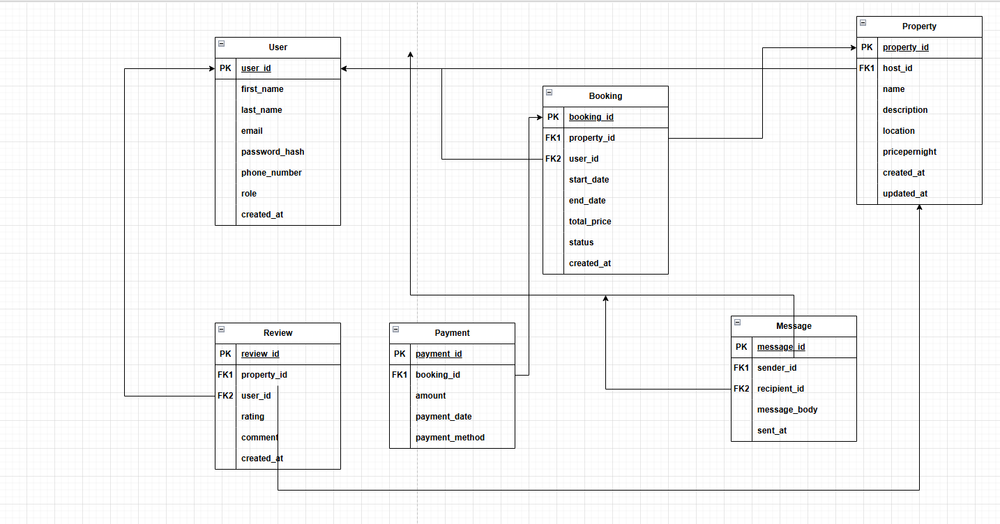

# Entities and Attributes

## User

| Attribute       |                           Type | Constraints                 |
| --------------- | -----------------------------: | --------------------------- |
| `user_id`       |                         `UUID` | Primary Key, Indexed        |
| `first_name`    |                      `VARCHAR` | NOT NULL                    |
| `last_name`     |                      `VARCHAR` | NOT NULL                    |
| `email`         |                      `VARCHAR` | UNIQUE, NOT NULL            |
| `password_hash` |                      `VARCHAR` | NOT NULL                    |
| `phone_number`  |                      `VARCHAR` | NULL                        |
| `role`          | `ENUM('guest','host','admin')` | NOT NULL                    |
| `created_at`    |                    `TIMESTAMP` | DEFAULT `CURRENT_TIMESTAMP` |

## Property

| Attribute       |        Type | Constraints                   |
| --------------- | ----------: | ----------------------------- |
| `property_id`   |      `UUID` | Primary Key, Indexed          |
| `host_id`       |      `UUID` | Foreign Key → `User(user_id)` |
| `name`          |   `VARCHAR` | NOT NULL                      |
| `description`   |      `TEXT` | NOT NULL                      |
| `location`      |   `VARCHAR` | NOT NULL                      |
| `pricepernight` |   `DECIMAL` | NOT NULL                      |
| `created_at`    | `TIMESTAMP` | DEFAULT `CURRENT_TIMESTAMP`   |
| `updated_at`    | `TIMESTAMP` | ON UPDATE `CURRENT_TIMESTAMP` |

## Booking

| Attribute     |                                     Type | Constraints                           |
| ------------- | ---------------------------------------: | ------------------------------------- |
| `booking_id`  |                                   `UUID` | Primary Key, Indexed                  |
| `property_id` |                                   `UUID` | Foreign Key → `Property(property_id)` |
| `user_id`     |                                   `UUID` | Foreign Key → `User(user_id)`         |
| `start_date`  |                                   `DATE` | NOT NULL                              |
| `end_date`    |                                   `DATE` | NOT NULL                              |
| `total_price` |                                `DECIMAL` | NOT NULL                              |
| `status`      | `ENUM('pending','confirmed','canceled')` | NOT NULL                              |
| `created_at`  |                              `TIMESTAMP` | DEFAULT `CURRENT_TIMESTAMP`           |

## Payment

| Attribute        |                                    Type | Constraints                         |
| ---------------- | --------------------------------------: | ----------------------------------- |
| `payment_id`     |                                  `UUID` | Primary Key, Indexed                |
| `booking_id`     |                                  `UUID` | Foreign Key → `Booking(booking_id)` |
| `amount`         |                               `DECIMAL` | NOT NULL                            |
| `payment_date`   |                             `TIMESTAMP` | DEFAULT `CURRENT_TIMESTAMP`         |
| `payment_method` | `ENUM('credit_card','paypal','stripe')` | NOT NULL                            |

## Review

| Attribute     |        Type | Constraints                                       |
| ------------- | ----------: | ------------------------------------------------- |
| `review_id`   |      `UUID` | Primary Key, Indexed                              |
| `property_id` |      `UUID` | Foreign Key → `Property(property_id)`             |
| `user_id`     |      `UUID` | Foreign Key → `User(user_id)`                     |
| `rating`      |   `INTEGER` | CHECK (`rating` >= 1 AND `rating` <= 5), NOT NULL |
| `comment`     |      `TEXT` | NOT NULL                                          |
| `created_at`  | `TIMESTAMP` | DEFAULT `CURRENT_TIMESTAMP`                       |

## Message

| Attribute      |        Type | Constraints                   |
| -------------- | ----------: | ----------------------------- |
| `message_id`   |      `UUID` | Primary Key, Indexed          |
| `sender_id`    |      `UUID` | Foreign Key → `User(user_id)` |
| `recipient_id` |      `UUID` | Foreign Key → `User(user_id)` |
| `message_body` |      `TEXT` | NOT NULL                      |
| `sent_at`      | `TIMESTAMP` | DEFAULT `CURRENT_TIMESTAMP`   |

## ERD Diagram

